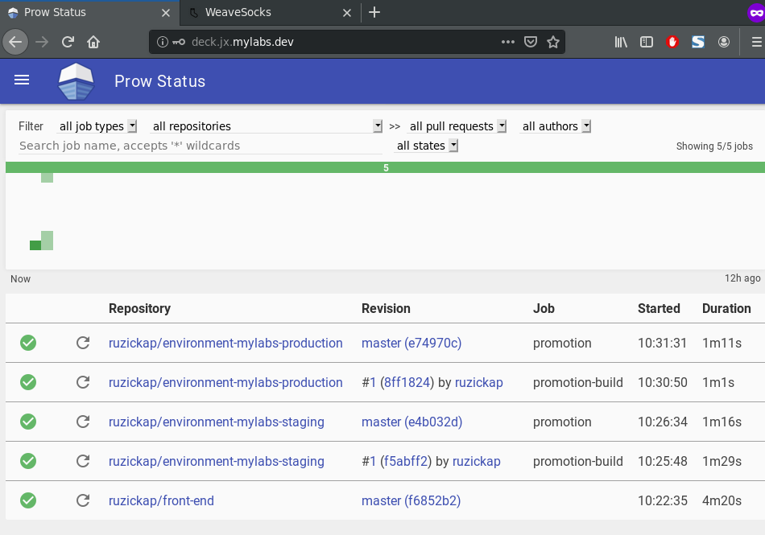

# Sock Shop

Open the Jenkins X installed services:

```bash
falkon https://deck.jx.mylabs.dev &
```

Deploy the Sock Shop microservices to the `jx-production` and `jx-staging`.
Only the `front-end` microservice will be modified and handled by Jenkins X.

```bash
sed "s/namespace: sock-shop/namespace: jx-production/" files/complete-demo.yaml | kubectl apply -f -
sed "s/namespace: sock-shop/namespace: jx-staging/"    files/complete-demo.yaml | kubectl apply -f -
```

Output:

```text
deployment.extensions/carts-db created
service/carts-db created
deployment.extensions/carts created
service/carts created
deployment.extensions/catalogue-db created
service/catalogue-db created
deployment.extensions/catalogue created
service/catalogue created
deployment.extensions/orders-db created
service/orders-db created
deployment.extensions/orders created
service/orders created
deployment.extensions/payment created
service/payment created
deployment.extensions/queue-master created
service/queue-master created
deployment.extensions/rabbitmq created
service/rabbitmq created
deployment.extensions/shipping created
service/shipping created
deployment.extensions/user-db created
service/user-db created
deployment.extensions/user created
service/user created
deployment.extensions/carts-db created
service/carts-db created
deployment.extensions/carts created
service/carts created
deployment.extensions/catalogue-db created
service/catalogue-db created
deployment.extensions/catalogue created
service/catalogue created
deployment.extensions/orders-db created
service/orders-db created
deployment.extensions/orders created
service/orders created
deployment.extensions/payment created
service/payment created
deployment.extensions/queue-master created
service/queue-master created
deployment.extensions/rabbitmq created
service/rabbitmq created
deployment.extensions/shipping created
service/shipping created
deployment.extensions/user-db created
service/user-db created
deployment.extensions/user created
service/user created
```

Fork the "Sock Shop" repository `front-end`:

```bash
mkdir tmp
cd tmp
hub clone "microservices-demo/front-end"
```

Output:

```text
Cloning into 'front-end'...

remote: Enumerating objects: 1156, done.
remote: Total 1156 (delta 0), reused 0 (delta 0), pack-reused 1156
Receiving objects: 100% (1156/1156), 47.86 MiB | 17.72 MiB/s, done.
Resolving deltas: 100% (642/642), done.
Updating ruzickap
From https://github.com/microservices-demo/front-end
 * [new branch]      abuehrle-patch-2                 -> ruzickap/abuehrle-patch-2
 * [new branch]      add-localserver-option           -> ruzickap/add-localserver-option
 * [new branch]      add-weave-imgs                   -> ruzickap/add-weave-imgs
 * [new branch]      add-zipkin                       -> ruzickap/add-zipkin
 * [new branch]      add_zipkin2                      -> ruzickap/add_zipkin2
 * [new branch]      adduser                          -> ruzickap/adduser
 * [new branch]      cpu_usage                        -> ruzickap/cpu_usage
 * [new branch]      deals-integration                -> ruzickap/deals-integration
 * [new branch]      documentation/commands           -> ruzickap/documentation/commands
 * [new branch]      enhancement/brander              -> ruzickap/enhancement/brander
 * [new branch]      enhancement/opentracing-frontend -> ruzickap/enhancement/opentracing-frontend
 * [new branch]      fix-42                           -> ruzickap/fix-42
 * [new branch]      hackathon-fixed                  -> ruzickap/hackathon-fixed
 * [new branch]      master                           -> ruzickap/master
 * [new branch]      remove-metric-cardinality        -> ruzickap/remove-metric-cardinality
new remote: ruzickap
```

The `jx import` command expects, that the `Dockerfile` will expose single port `8080`.
Therefore I need to change this in `front-end` Docker file to be able to work
with `jx import` smoothly:

```bash
sed -i 's/8079/8080/' front-end/Dockerfile
git -C front-end add Dockerfile
git -C front-end commit -m "Port in Dockerfile changed from 8079 to 8080"
```

Fork the repository and push the changes there:

```bash
hub -C "front-end" fork
git -C front-end push ruzickap
rm -rf "front-end"
```

Import application into Jenkins X:

```bash
jx import --git-username=ruzickap --name="front-end" --url="https://github.com/ruzickap/front-end"
```

Output:

```text
Using Git user name: ruzickap
performing pack detection in folder /home/pruzicka/git/k8s-jenkins-x/tmp/front-end
--> Draft detected Coq (51.985930%)
--> Could not find a pack for Coq. Trying to find the next likely language match...
--> Draft detected SVG (16.817856%)
--> Could not find a pack for SVG. Trying to find the next likely language match...
--> Draft detected HTML (16.808026%)
--> Could not find a pack for HTML. Trying to find the next likely language match...
--> Draft detected JavaScript (9.282228%)
selected pack: /home/pruzicka/.jx/draft/packs/github.com/jenkins-x-buildpacks/jenkins-x-kubernetes/packs/javascript
replacing placeholders in directory /home/pruzicka/git/k8s-jenkins-x/tmp/front-end
app name: front-end, git server: github.com, org: ruzickap, Docker registry org: ruzickap
skipping directory "/home/pruzicka/git/k8s-jenkins-x/tmp/front-end/.git"
Let's ensure that we have an ECR repository for the Docker image ruzickap/front-end
Creating GitHub webhook for ruzickap/front-end for url http://hook.jx.mylabs.dev/hook

Watch pipeline activity via:    jx get activity -f front-end -w
Browse the pipeline log via:    jx get build logs ruzickap/front-end/master
You can list the pipelines via: jx get pipelines
When the pipeline is complete:  jx get applications

For more help on available commands see: https://jenkins-x.io/developing/browsing/

Note that your first pipeline may take a few minutes to start while the necessary images get downloaded!
```

Browse the pipeline log via:

```bash
jx get build logs ruzickap/front-end/master
```

Output:

```text
wrote: /tmp/45e0bfe7-1813-41ac-8ff0-5335c09d5fa5001229297

Showing logs for build ruzickap-front-end-master-1 stage from-build-pack and container step-credential-initializer-76547
{"level":"warn","ts":1571046398.8420925,"logger":"fallback-logger","caller":"logging/config.go:69","msg":"Fetch GitHub commit ID from kodata failed: \"ref: refs/heads/master\" is not a valid GitHub commit ID"}
{"level":"info","ts":1571046398.8425908,"logger":"fallback-logger","caller":"creds-init/main.go:40","msg":"Credentials initialized."}

Showing logs for build ruzickap-front-end-master-1 stage from-build-pack and container step-working-dir-initializer-m47vj
{"level":"warn","ts":1571046400.955852,"logger":"fallback-logger","caller":"logging/config.go:69","msg":"Fetch GitHub commit ID from kodata failed: open /var/run/ko/HEAD: no such file or directory"}
{"level":"info","ts":1571046400.962778,"logger":"fallback-logger","caller":"bash/main.go:65","msg":"Successfully executed command \"mkdir -p /workspace/source\""}

Showing logs for build ruzickap-front-end-master-1 stage from-build-pack and container step-place-tools

Showing logs for build ruzickap-front-end-master-1 stage from-build-pack and container step-git-source-ruzickap-front-end-master-sz7fg
{"level":"warn","ts":1571046430.2503226,"logger":"fallback-logger","caller":"logging/config.go:69","msg":"Fetch GitHub commit ID from kodata failed: \"ref: refs/heads/master\" is not a valid GitHub commit ID"}
{"level":"info","ts":1571046433.3666754,"logger":"fallback-logger","caller":"git/git.go:102","msg":"Successfully cloned https://github.com/********/front-end.git @ v0.3.13 in path /workspace/source"}

Showing logs for build ruzickap-front-end-master-1 stage from-build-pack and container step-git-merge
Using SHAs from PULL_REFS=master:1e15c6743eac28ac992b1881214aad9ef70e3899
WARNING: no SHAs to merge, falling back to initial cloned commit

Showing logs for build ruzickap-front-end-master-1 stage from-build-pack and container step-setup-jx-git-credentials
Generated Git credentials file /workspace/xdg_config/git/credentials

Showing logs for build ruzickap-front-end-master-1 stage from-build-pack and container step-build-npmrc
WARNING: failed to find Secret npm-token in namespace **

Showing logs for build ruzickap-front-end-master-1 stage from-build-pack and container step-build-npm-install
npm WARN deprecated istanbul@0.4.5: This module is no longer maintained, try this instead:
npm WARN deprecated   npm i nyc
npm WARN deprecated Visit https://istanbul.js.org/integrations for other alternatives.
npm WARN deprecated formatio@1.1.1: This package is unmaintained. Use @sinonjs/formatio instead
npm WARN deprecated samsam@1.1.2: This package has been deprecated in favour of @sinonjs/samsam
npm WARN deprecated json3@3.3.2: Please use the native JSON object instead of JSON 3
npm WARN deprecated samsam@1.1.3: This package has been deprecated in favour of @sinonjs/samsam
npm WARN deprecated superagent@2.3.0: Please note that v5.0.1+ of superagent removes User-Agent header by default, therefore you may need to add it yourself (e.g. GitHub blocks requests without a User-Agent header).  This notice will go away with v5.0.2+ once it is released.
npm notice created a lockfile as package-lock.json. You should commit this file.
added 246 packages from 706 contributors and audited 489 packages in 6.842s
found 4 vulnerabilities (3 low, 1 critical)
  run `npm audit fix` to fix them, or `npm audit` for details

Showing logs for build ruzickap-front-end-master-1 stage from-build-pack and container step-build-npm-test

> microservices-demo-front-end@0.0.1 test /workspace/source
> istanbul cover node_modules/.bin/_mocha -- test/*_test.js test/api/*_test.js


  helpers
    #errorHandler
      the rendered JSON
        ✓ includes an error message
        ✓ includes an error object
        ✓ returns the right HTTP status code
      given the error has no status defined
        ✓ responds with HTTP status code 500
    #respondSuccessBody
      ✓ renders the given body with status 200 OK
    #respondStatusBody
      ✓ sets the proper status code & body
    #respondStatus
      ✓ sets the proper status code
    #simpleHttpRequest
      ✓ performs a GET request to the given URL
      given the external service responds with success
        ✓ yields the external service response to the response body
        ✓ responds with success
      given the external service fails
        ✓ invokes the given callback with an error object
    #getCustomerId
      given the environment is development
        - returns the customer id from the query string
      given a customer id set in session
        - returns the customer id from the session
      given no customer id set in the cookies
        given no customer id set session
          - throws a 'User not logged in' error

  endpoints
    catalogueUrl
      ✓ points to the proper endpoint
    tagsUrl
      ✓ points to the proper endpoint
    cartsUrl
      ✓ points to the proper endpoint
    ordersUrl
      ✓ points to the proper endpoint
    customersUrl
      ✓ points to the proper endpoint
    addressUrl
      ✓ points to the proper endpoint
    cardsUrl
      ✓ points to the proper endpoint
    loginUrl
      ✓ points to the proper endpoint
    registerUrl
      ✓ points to the proper endpoint


  20 passing (68ms)
  3 pending

=============================================================================
Writing coverage object [/workspace/source/coverage/coverage.json]
Writing coverage reports at [/workspace/source/coverage]
=============================================================================

=============================== Coverage summary ===============================
Statements   : 65.96% ( 31/47 )
Branches     : 22.73% ( 5/22 )
Functions    : 75% ( 9/12 )
Lines        : 65.22% ( 30/46 )
================================================================================

Showing logs for build ruzickap-front-end-master-1 stage from-build-pack and container step-build-container-build
INFO[0000] Downloading base image node:10-alpine
INFO[0001] Error while retrieving image from cache: getting file info: stat /workspace/sha256:5cf3bedcacc2b6ae46504c4c165c74ae88b5fb5eb67f9dfcc3b0cca193f366ff: no such file or directory
INFO[0001] Downloading base image node:10-alpine
INFO[0002] cmd: EXPOSE
INFO[0002] Adding exposed port: 8079/tcp
INFO[0002] Checking for cached layer 822044714040.dkr.ecr.eu-central-1.amazonaws.com/todo/cache:9458c2f9880e5456febdb8ff92df198eb64dcf22e3de9326e1bac696d54ee6a2...
INFO[0002] No cached layer found for cmd RUN addgroup mygroup && adduser -D -G mygroup myuser && mkdir -p /usr/src/app && chown -R myuser /usr/src/app
INFO[0002] Unpacking rootfs as cmd RUN addgroup mygroup && adduser -D -G mygroup myuser && mkdir -p /usr/src/app && chown -R myuser /usr/src/app requires it.
INFO[0004] Taking snapshot of full filesystem...
INFO[0004] ENV NODE_ENV "production"
INFO[0004] No files changed in this command, skipping snapshotting.
INFO[0004] ENV PORT 8079
INFO[0004] No files changed in this command, skipping snapshotting.
INFO[0004] EXPOSE 8079
INFO[0004] cmd: EXPOSE
INFO[0004] Adding exposed port: 8079/tcp
INFO[0004] No files changed in this command, skipping snapshotting.
INFO[0004] RUN addgroup mygroup && adduser -D -G mygroup myuser && mkdir -p /usr/src/app && chown -R myuser /usr/src/app
INFO[0004] cmd: /bin/sh
INFO[0004] args: [-c addgroup mygroup && adduser -D -G mygroup myuser && mkdir -p /usr/src/app && chown -R myuser /usr/src/app]
INFO[0004] Taking snapshot of full filesystem...
INFO[0005] WORKDIR /usr/src/app
INFO[0005] cmd: workdir
INFO[0005] Changed working directory to /usr/src/app
INFO[0005] No files changed in this command, skipping snapshotting.
INFO[0005] Using files from context: [/workspace/source/package.json]
INFO[0005] COPY package.json /usr/src/app/
INFO[0005] Taking snapshot of files...
INFO[0005] Pushing layer 822044714040.dkr.ecr.eu-central-1.amazonaws.com/todo/cache:9458c2f9880e5456febdb8ff92df198eb64dcf22e3de9326e1bac696d54ee6a2 to cache now
INFO[0005] Using files from context: [/workspace/source/yarn.lock]
INFO[0005] COPY yarn.lock /usr/src/app/
INFO[0005] Taking snapshot of files...
INFO[0005] RUN chown myuser /usr/src/app/yarn.lock
INFO[0005] cmd: /bin/sh
INFO[0005] args: [-c chown myuser /usr/src/app/yarn.lock]
INFO[0005] Taking snapshot of full filesystem...
INFO[0005] Pushing layer 822044714040.dkr.ecr.eu-central-1.amazonaws.com/todo/cache:1e3ef72fef388a5abb71e62ddca5cd18e9218fa8c85345a8719728843d2db514 to cache now
INFO[0005] USER myuser
INFO[0005] cmd: USER
INFO[0005] No files changed in this command, skipping snapshotting.
INFO[0005] RUN yarn install
INFO[0005] cmd: /bin/sh
INFO[0005] args: [-c yarn install]
yarn install v1.17.3
[1/4] Resolving packages...
[2/4] Fetching packages...
[3/4] Linking dependencies...
[4/4] Building fresh packages...
success Saved lockfile.
Done in 3.23s.
INFO[0009] Taking snapshot of full filesystem...
INFO[0011] Using files from context: [/workspace/source]
INFO[0011] Pushing layer 822044714040.dkr.ecr.eu-central-1.amazonaws.com/todo/cache:87c4932016bc343a60884c97ee4ff451f359ba8f41177075ccddd0f8ad4ee657 to cache now
INFO[0012] COPY . /usr/src/app
INFO[0012] Taking snapshot of files...
INFO[0014] CMD ["/usr/local/bin/npm", "start"]
INFO[0014] No files changed in this command, skipping snapshotting.
WARN[0014] error uploading layer to cache: failed to push to destination 822044714040.dkr.ecr.eu-central-1.amazonaws.com/todo/cache:9458c2f9880e5456febdb8ff92df198eb64dcf22e3de9326e1bac696d54ee6a2: NAME_UNKNOWN: The repository with name 'todo/cache' does not exist in the registry with id '822044714040'
2019/10/14 09:47:39 pushed blob: sha256:52117deb28a49c267075339aa726f6573bd01648d45057a8f9ee516788917dad
2019/10/14 09:47:39 pushed blob: sha256:8712bff5b08bdadf2852a11ce08e6acf3b29f71d091387594a4a07091e421761
2019/10/14 09:47:39 pushed blob: sha256:e886e35b1b64d2c588eacb18cf6e339402f0c0e2a7588a13126252fc7e4a95bc
2019/10/14 09:47:39 pushed blob: sha256:124143aea6993386d63775d02bdd6bb64bdcb236ad2d7170970fb67665578c1f
2019/10/14 09:47:39 pushed blob: sha256:f1aa070a8191461caef27a44c28a59c30fcab9c39205f04a45b6e3f8facb4507
2019/10/14 09:47:39 pushed blob: sha256:284842a36c0d8eea230cfd5e7a4a6b450fcd63d1c4737f236a91e1671455050a
2019/10/14 09:47:39 pushed blob: sha256:e7c96db7181be991f19a9fb6975cdbbd73c65f4a2681348e63a141a2192a5f10
2019/10/14 09:47:40 pushed blob: sha256:56174ae7ed1d5c96ca66882e205154d7067a1a8a325bd8fdec6d5f933f66e0a3
2019/10/14 09:47:42 pushed blob: sha256:50958466d97a8d1ceedc4e851de4fc43e3e3e0618e548597f63f0b546cb8797c
2019/10/14 09:47:42 pushed blob: sha256:bbd6979480d9d48c884a83df847d648fc325ea23b656bfafcd070bd949ccd46b
2019/10/14 09:47:54 pushed blob: sha256:1432e6d773e0ad4f2a6b299548c277d29033893d581c66dc5eec06d213854f27
2019/10/14 09:47:54 822044714040.dkr.ecr.eu-central-1.amazonaws.com/********/front-end:0.3.13: digest: sha256:9b65f158a9345a76af0fca735d0f0bfb6d278b414aa9854afa61803f7e9730ec size: 1893

Showing logs for build ruzickap-front-end-master-1 stage from-build-pack and container step-build-post-build
no CVE provider running in the current ** namespace so skip adding image to be analysed

Showing logs for build ruzickap-front-end-master-1 stage from-build-pack and container step-promote-changelog
Converted /workspace/source/charts/front-end to an unshallow repository
Generating change log from git ref b2308a3ecc70b9ac97b93ce73985e57d5d0c186b => ff2e70d95abc6465d299c065890824815a5e9bc5
Associating user x-0 in users.jenkins.io with email petr.ruzicka@gmail.com to git GitProvider user with login -0 as emails match
Adding label jenkins.io/git-github-userid=-0 to user x-0 in users.jenkins.io
WARNING: Failed to enrich commit 1e15c6743eac28ac992b1881214aad9ef70e3899 with issues: User.jenkins.io "x-0" is invalid: metadata.labels: Invalid value: "-0": a valid label must be an empty string or consist of alphanumeric characters, '-', '_' or '.', and must start and end with an alphanumeric character (e.g. 'MyValue',  or 'my_value',  or '12345', regex used for validation is '(([A-Za-z0-9][-A-Za-z0-9_.]*)?[A-Za-z0-9])?')
Finding issues in commit messages using git format
WARNING: Failed to enrich commit a73c693b4b4d4eb2cfc6d4d386a69d29648fc59c with issues: users.jenkins.io "x-0" already exists
WARNING: Failed to enrich commit a73c693b4b4d4eb2cfc6d4d386a69d29648fc59c with issues: users.jenkins.io "x-0" already exists
WARNING: Failed to enrich commit b1ff2c3b4b1af9fdee85320a8ce7b4af39e3c582 with issues: users.jenkins.io "x-0" already exists
WARNING: Failed to enrich commit b1ff2c3b4b1af9fdee85320a8ce7b4af39e3c582 with issues: users.jenkins.io "x-0" already exists
WARNING: Failed to enrich commit 8fc609241f33c15531d6997155a5ad25974d841b with issues: users.jenkins.io "x-0" already exists
WARNING: Failed to enrich commit 8fc609241f33c15531d6997155a5ad25974d841b with issues: users.jenkins.io "x-0" already exists
WARNING: Failed to enrich commit 61d1fdf3ed96a7172e0a2cbaf136d158784f09c0 with issues: users.jenkins.io "x-0" already exists
WARNING: Failed to enrich commit 61d1fdf3ed96a7172e0a2cbaf136d158784f09c0 with issues: users.jenkins.io "x-0" already exists
WARNING: Failed to enrich commit f7775f5882f39b0e3c579d880311f4020a4d97fd with issues: users.jenkins.io "x-0" already exists
WARNING: Failed to enrich commit f7775f5882f39b0e3c579d880311f4020a4d97fd with issues: users.jenkins.io "x-0" already exists
WARNING: Failed to enrich commit 82ebb7c9a018063aaeff91eeebdd9e8e4d810519 with issues: users.jenkins.io "x-0" already exists
WARNING: Failed to enrich commit 82ebb7c9a018063aaeff91eeebdd9e8e4d810519 with issues: users.jenkins.io "x-0" already exists
WARNING: Failed to enrich commit c3eebf2763bdd9a1e0cc5a0f2a9f402ed8c269aa with issues: users.jenkins.io "x-0" already exists
WARNING: Failed to enrich commit c3eebf2763bdd9a1e0cc5a0f2a9f402ed8c269aa with issues: users.jenkins.io "x-0" already exists
WARNING: Failed to enrich commit 390c3fd9ecd95db19eb1044d83161e3d4e261219 with issues: users.jenkins.io "x-0" already exists
WARNING: Failed to enrich commit 390c3fd9ecd95db19eb1044d83161e3d4e261219 with issues: users.jenkins.io "x-0" already exists
WARNING: Failed to enrich commit 7bc6120079b3d403d75a0bfc2248441e94bcdf4f with issues: users.jenkins.io "x-0" already exists
WARNING: Failed to enrich commit 7bc6120079b3d403d75a0bfc2248441e94bcdf4f with issues: users.jenkins.io "x-0" already exists
WARNING: Failed to enrich commit 5adfac298a9d65061b86eba813cab4f151132ae7 with issues: users.jenkins.io "x-0" already exists
WARNING: Failed to enrich commit 5adfac298a9d65061b86eba813cab4f151132ae7 with issues: users.jenkins.io "x-0" already exists
WARNING: Failed to enrich commit d2803dc6f6f46aa34494640b45b8b600d5fbef57 with issues: users.jenkins.io "x-0" already exists
WARNING: Failed to enrich commit d2803dc6f6f46aa34494640b45b8b600d5fbef57 with issues: users.jenkins.io "x-0" already exists
WARNING: Failed to enrich commit e0ed7795e74370b90a3f57da641f25764966768f with issues: users.jenkins.io "x-0" already exists
WARNING: Failed to enrich commit e0ed7795e74370b90a3f57da641f25764966768f with issues: users.jenkins.io "x-0" already exists
WARNING: Failed to enrich commit cd028e31f06a245fe641fb138c8e91165e80ccbb with issues: users.jenkins.io "x-0" already exists
WARNING: Failed to enrich commit cd028e31f06a245fe641fb138c8e91165e80ccbb with issues: users.jenkins.io "x-0" already exists
WARNING: No release found for ********/front-end and tag v0.3.13 so creating a new release
Updated the release information at https://github.com/********/front-end/releases/tag/v0.3.13
generated: /workspace/source/charts/front-end/templates/release.yaml
Created Release front-end-0-3-13 resource in namespace **
Updating PipelineActivity ********-front-end-master-1 with version 0.3.13
Updated PipelineActivities ********-front-end-master-1 with release notes URL: https://github.com/********/front-end/releases/tag/v0.3.13

Showing logs for build ruzickap-front-end-master-1 stage from-build-pack and container step-promote-helm-release
WARNING: No $CHART_REPOSITORY defined so using the default value of: http://jenkins-x-chartmuseum:8080
Adding missing Helm repo: storage.googleapis.com https://storage.googleapis.com/chartmuseum.jenkins-x.io
Successfully added Helm repository storage.googleapis.com.
Adding missing Helm repo: jenkins-x-chartmuseum http://jenkins-x-chartmuseum:8080
Successfully added Helm repository jenkins-x-chartmuseum.
WARNING: No $CHART_REPOSITORY defined so using the default value of: http://jenkins-x-chartmuseum:8080
Uploading chart file front-end-0.3.13.tgz to http://jenkins-x-chartmuseum:8080/api/charts
Received 201 response: {"saved":true}

Showing logs for build ruzickap-front-end-master-1 stage from-build-pack and container step-promote-jx-promote
WARNING: prow based install so skip waiting for the merge of Pull Requests to go green as currently there is an issue with gettingstatuses from the PR, see https://github.com/jenkins-x/**/issues/2410
Promoting app front-end version 0.3.13 to namespace **-staging
Created Pull Request: https://github.com/********/environment-mylabs-staging/pull/1
Pull Request https://github.com/********/environment-mylabs-staging/pull/1 is merged at sha e3cb9b2001a772c0e52eff8a13188b1718986f3c
Pull Request merged but we are not waiting for the update pipeline to complete!
WARNING: Could not find the service URL in namespace **-staging for names front-end, **-front-end, **-staging-front-end
```

Watch pipeline activity via:

```bash
jx get activity -f front-end
```

Output:

```text
STEP                                                STARTED AGO DURATION STATUS
ruzickap/front-end/master #1                              9m46s    3m33s Succeeded Version: 0.3.13
  meta pipeline                                           9m46s      28s Succeeded
    Credential Initializer Pppjv                          9m46s       0s Succeeded
    Working Dir Initializer Wz5tq                         9m46s       2s Succeeded
    Place Tools                                           9m44s       2s Succeeded
    Git Source Meta Ruzickap Front End Master Pc5dz       9m42s      12s Succeeded https://github.com/ruzickap/front-end.git
    Git Merge                                             9m30s       1s Succeeded
    Merge Pull Refs                                       9m29s       0s Succeeded
    Create Effective Pipeline                             9m29s       4s Succeeded
    Create Tekton Crds                                    9m25s       7s Succeeded
  from build pack                                         9m15s     3m2s Succeeded
    Credential Initializer 76547                          9m15s       0s Succeeded
    Working Dir Initializer M47vj                         9m15s       2s Succeeded
    Place Tools                                           9m13s       2s Succeeded
    Git Source Ruzickap Front End Master Sz7fg            9m11s      31s Succeeded https://github.com/ruzickap/front-end.git
    Git Merge                                             8m40s       0s Succeeded
    Setup Jx Git Credentials                              8m40s       1s Succeeded
    Build Npmrc                                           8m39s       0s Succeeded
    Build Npm Install                                     8m39s       7s Succeeded
    Build Npm Test                                        8m32s       2s Succeeded
    Build Container Build                                 8m30s      31s Succeeded
    Build Post Build                                      7m59s       1s Succeeded
    Promote Changelog                                     7m58s      26s Succeeded
    Promote Helm Release                                  7m32s       4s Succeeded
    Promote Jx Promote                                    7m28s    1m15s Succeeded
  Promote: staging                                        7m20s     1m6s Succeeded
    PullRequest                                           7m20s     1m6s Succeeded  PullRequest: https://github.com/ruzickap/environment-mylabs-staging/pull/1 Merge SHA: e3cb9b2001a772c0e52eff8a13188b1718986f3c
    Update                                                6m14s       0s Succeeded
```

Check the applications:

```bash
jx get applications
```

Output:

```text
APPLICATION  STAGING PODS URL                                    PRODUCTION PODS URL
carts                1/1                                                    1/1
carts-db             1/1                                                    1/1
catalogue            1/1                                                    1/1
catalogue-db         1/1                                                    1/1
front-end    0.3.13  1/1  http://front-end.jx-staging.mylabs.dev
orders               1/1                                                    1/1
orders-db            1/1                                                    1/1
payment              1/1                                                    1/1
queue-master         1/1                                                    1/1
rabbitmq             1/1                                                    1/1
shipping             1/1                                                    1/1
user                 1/1                                                    1/1
user-db              1/1                                                    1/1
```

Verify the URLs:

```bash
jx get urls -n jx-staging
```

Output:

```text
NAME      URL
front-end http://front-end.jx-staging.mylabs.dev
```

The application was only deployed on the staging environment [http://front-end.jx-staging.mylabs.dev/](http://front-end.jx-staging.mylabs.dev/)
and now it is time to promote it to production:


```bash
jx promote front-end --build="1" --version 0.3.13 --env production --batch-mode=true
```

You should be able to see the same Sock Shop instance on this URL: [http://front-end.jx-production.mylabs.dev/](http://front-end.jx-production.mylabs.dev/)

Check the production URLs:

```bash
jx get urls -n jx-production
```

```text
NAME      URL
front-end http://front-end.jx-production.mylabs.dev
```

The promotion to production was done successfully:

```bash
jx get activity
```

Output:

```text
```

Verify the `pipelineactivity`:

```bash
kubectl get pipelineactivity
```

Output:

```text
NAME                                              GIT URL                                                         STATUS
ruzickap-environment-mylabs-production-master-1   https://github.com/ruzickap/environment-mylabs-production.git   Succeeded
ruzickap-environment-mylabs-production-pr-1-1     https://github.com/ruzickap/environment-mylabs-production.git   Succeeded
ruzickap-environment-mylabs-staging-master-1      https://github.com/ruzickap/environment-mylabs-staging.git      Succeeded
ruzickap-environment-mylabs-staging-pr-1-1        https://github.com/ruzickap/environment-mylabs-staging.git      Succeeded
ruzickap-front-end-master-1                       https://github.com/ruzickap/front-end.git                       Succeeded
ruzickap-k8s-jenkins-x-master-1                   git@github.com:ruzickap/k8s-jenkins-x.git                       Running
```

Look at the Tekton's `pipelineruns`:

```bash
kubectl get pipelineruns.tekton.dev --all-namespaces
```

Output:

```text
NAMESPACE   NAME                                      AGE
jx          meta-ruzickap-environment-mylab-1         19m
jx          meta-ruzickap-environment-mylab-747q9-1   18m
jx          meta-ruzickap-environment-mylab-8bfcf-1   13m
jx          meta-ruzickap-environment-mylab-jxm8t-1   14m
jx          meta-ruzickap-front-end-master-1          22m
jx          ruzickap-environment-mylabs-pro-1         13m
jx          ruzickap-environment-mylabs-pro-24wxn-1   13m
jx          ruzickap-environment-mylabs-sta-1         18m
jx          ruzickap-environment-mylabs-sta-lk6jd-1   17m
jx          ruzickap-front-end-master-1               21m
```

Those pods were created by the pipelines during the build process:

```bash
kubectl get pods -l jenkins.io/pipelineType=build -n jx
```

Output:

```text
NAME                                                                       READY   STATUS      RESTARTS   AGE
ruzickap-environment-mylabs-pro-1-from-build-pack-nsfmf-pod-83ef21         0/3     Completed   0          16m
ruzickap-environment-mylabs-pro-24wxn-1-from-build-pack-b9z5t-pod-0939a5   0/4     Completed   0          15m
ruzickap-environment-mylabs-sta-1-from-build-pack-zzlpd-pod-7c9762         0/3     Completed   0          21m
ruzickap-environment-mylabs-sta-lk6jd-1-from-build-pack-7tx4q-pod-f53dd8   0/4     Completed   0          20m
ruzickap-front-end-master-1-from-build-pack-m8q27-pod-2b0855               0/11    Completed   0          24m
```

See the labels on one of the pods created during the build process:

```bash
kubectl get pods $(kubectl get pods -l jenkins.io/pipelineType=build -n jx -o "jsonpath={.items[0].metadata.name}") -n jx --show-labels
```

Output:

```text
NAME                                                                 READY   STATUS      RESTARTS   AGE   LABELS
ruzickap-environment-mylabs-pro-1-from-build-pack-nsfmf-pod-83ef21   0/3     Completed   0          23m   branch=PR-1,build=1,context=promotion-build,created-by-prow=true,jenkins.io/pipelineType=build,jenkins.io/task-stage-name=from-build-pack,owner=ruzickap,prowJobName=1852a6ff-ef26-11e9-b913-8e0056803543,repository=environment-mylabs-production,tekton.dev/pipeline=ruzickap-environment-mylabs-pro-1,tekton.dev/pipelineRun=ruzickap-environment-mylabs-pro-1,tekton.dev/pipelineTask=from-build-pack,tekton.dev/task=ruzickap-environment-mylabs-pro-from-build-pack-1,tekton.dev/taskRun=ruzickap-environment-mylabs-pro-1-from-build-pack-nsfmf
```

List all the pipelines using the `tkn` command (default Tekton client):

```bash
tkn pipeline list -n jx
```

Output:

```text
NAME                                      AGE              LAST RUN                                  STARTED          DURATION     STATUS
meta-ruzickap-environment-mylab-1         29 minutes ago   meta-ruzickap-environment-mylab-1         29 minutes ago   24 seconds   Succeeded
meta-ruzickap-environment-mylab-747q9-1   29 minutes ago   meta-ruzickap-environment-mylab-747q9-1   29 minutes ago   27 seconds   Succeeded
meta-ruzickap-environment-mylab-8bfcf-1   24 minutes ago   meta-ruzickap-environment-mylab-8bfcf-1   24 minutes ago   22 seconds   Succeeded
meta-ruzickap-environment-mylab-jxm8t-1   24 minutes ago   meta-ruzickap-environment-mylab-jxm8t-1   24 minutes ago   24 seconds   Succeeded
meta-ruzickap-front-end-master-1          33 minutes ago   meta-ruzickap-front-end-master-1          33 minutes ago   58 seconds   Succeeded
ruzickap-environment-mylabs-pro-1         24 minutes ago   ruzickap-environment-mylabs-pro-1         24 minutes ago   39 seconds   Succeeded
ruzickap-environment-mylabs-pro-24wxn-1   23 minutes ago   ruzickap-environment-mylabs-pro-24wxn-1   23 minutes ago   51 seconds   Succeeded
ruzickap-environment-mylabs-sta-1         29 minutes ago   ruzickap-environment-mylabs-sta-1         29 minutes ago   1 minute     Succeeded
ruzickap-environment-mylabs-sta-lk6jd-1   28 minutes ago   ruzickap-environment-mylabs-sta-lk6jd-1   28 minutes ago   52 seconds   Succeeded
ruzickap-front-end-master-1               32 minutes ago   ruzickap-front-end-master-1               32 minutes ago   3 minutes    Succeeded
```

Screenshot form Prow [https://deck.jx.mylabs.dev](https://deck.jx.mylabs.dev):



You may also see the Tekton Pipelines using Tekton Dashboard [https://tekton-dashboard.jx.mylabs.dev](https://tekton-dashboard.jx.mylabs.dev):


